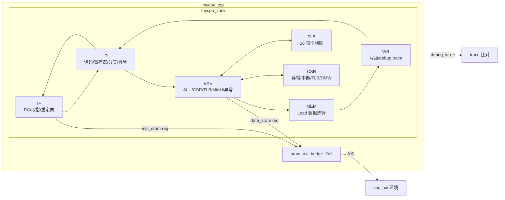

# Ourcpu LoongArch 五级流水 AXI CPU

本仓库保存的是一套面向《CPU 设计实战 LoongArch 版》实验环境的 32 位 LoongArch 风格五级流水 CPU。当前版本已经从早期的基础整数指令、CSR、异常、中断和 AXI 总线实验，推进到 exp19，对 TLB、虚实地址转换、TLB 相关异常和 DMW 直接映射窗口完成了集成。

当前代码已在 Vivado 2019.2 下通过 exp19 的 AXI SoC 功能仿真、综合、实现、bitstream 生成和上板验证。验证代码、testbench、func 程序和官方 SoC 框架没有作为通过测试的手段被修改，主要改动集中在 CPU 实现文件。

## 当前状态

最后一次完整验证状态如下：

```text
实验目标: exp19
验证环境: output/exp19/soc_verify/soc_axi
Vivado 版本: 2019.2
仿真结果: PASS
最终功能点: Number 8'd72 Functional Test Point PASS!!!
实现结果: write_bitstream Complete
时序结果: WNS = 0.164 ns, TNS = 0.000 ns, WHS = 0.088 ns
bit 文件: output/exp19/soc_verify/soc_axi/run_vivado/project/loongson.runs/impl_1/soc_lite_top.bit
```

上板验证时，测试程序正常运行后，数码管会从 `01000001` 逐步递增，最终停在：

```text
48000048
```

含义如下：

```text
高 8 位 0x48: 当前功能测试点编号 72
低 8 位 0x48: 已通过功能测试点数量 72
```

## 当前工作内容概览

本阶段完成的核心工作可以概括为四部分：

1. 完成 exp18 的 TLB 指令和 TLB CSR 支持。
2. 完成 exp19 的 TLB 异常、DMW CSR 和虚实地址映射。
3. 修复 AXI SoC 环境下的取指响应和 PC 绑定问题。
4. 优化除法器、冒险处理和 SRAM-to-AXI bridge，使设计能够通过实现时序并上板运行。

已经支持的 exp18/exp19 关键内容：

```text
TLB 指令:
tlbsrch, tlbrd, tlbwr, tlbfill, invtlb

TLB/DMW CSR:
TLBIDX, TLBEHI, TLBELO0, TLBELO1, ASID, TLBRENTRY, DMW0, DMW1

TLB/MMU 异常:
TLBR, PIL, PIS, PIF, PME, PPI

地址映射:
直接地址模式, DMW 直接映射窗口, TLB 页表映射
```

## 目录和文件

根目录下的 Verilog 文件是当前 CPU 的主实现：

```text
alu.v
csr_regfile.v
decoder_2_4.v
decoder_4_16.v
decoder_5_32.v
decoder_6_64.v
exe_stage.v
id_stage.v
if_stage.v
mem_stage.v
mycpu.vh
mycpu_top.v
regfile.v
tlb.v
wb_stage.v
```

exp19 工程实际引用的 CPU 副本位于：

```text
output/exp19/myCPU
```

当前调试习惯是：

```text
根目录 CPU 源码作为主版本
output/exp19/myCPU 作为 exp19 Vivado 工程引用副本
```

exp19 AXI SoC 验证工程入口：

```text
output/exp19/soc_verify/soc_axi/run_vivado/project/loongson.xpr
```

已生成的上板 bit 文件：

```text
output/exp19/soc_verify/soc_axi/run_vivado/project/loongson.runs/impl_1/soc_lite_top.bit
```

已经清理掉 Vivado 运行日志、`.Xil`、`*.cache`、`*.sim` 等临时文件。重新打开工程或重新运行仿真/实现时，Vivado 会自动再生成这些文件。

## 总体架构

CPU 内核采用经典五级流水：

```text
IF  ->  ID  ->  EXE  ->  MEM  ->  WB
取指    译码    执行    访存    写回
```

流水级之间使用 `valid/allowin` 握手机制：

```verilog
allowin       = !valid || (ready_go && next_allowin);
to_next_valid = valid && ready_go;
```

整体结构如下：



## 文件职责

### `mycpu_top.v`

CPU 顶层，连接五级流水、AXI 桥接、debug trace 和外部中断输入。

当前重点：

- 对外提供 AXI 主接口。
- 内部保留类 SRAM 风格的取指和访存请求。
- 使用 `sram_axi_bridge_2x1` 把内部 SRAM 风格请求转换为 AXI 事务。
- 通过请求寄存化切断 EXE 访存地址到官方 AXI RAM/IP 的关键路径。
- 保留功能测试需要的 `debug_wb_pc`、`debug_wb_rf_we`、`debug_wb_rf_wnum`、`debug_wb_rf_wdata`。

### `if_stage.v`

取指阶段。

当前重点：

- 维护 PC。
- 发起取指请求。
- 处理分支、异常和 `ertn` 重定向。
- 检测取指地址 ADEF。
- 保存 `req_pc`，保证 AXI 返回数据和发出请求时的 PC 绑定。
- 使用 `req_cancel` 处理请求期间发生的重定向，避免旧响应进入后续流水级。
- 接收 EXE 阶段给出的取指物理地址和取指 TLB 异常。

### `id_stage.v`

译码阶段。

当前重点：

- 基础指令译码。
- CSR 指令译码。
- TLB 指令译码。
- 通用寄存器读。
- 分支判断。
- RAW 冒险、load-use 冒险、CSR 冒险和系统指令相关阻塞。
- 将 TLB 操作类型和 `invtlb` 操作码通过流水总线送入 EXE。

### `exe_stage.v`

执行阶段，是当前版本中最关键、最复杂的模块。

当前重点：

- 执行 ALU 运算。
- 控制迭代除法器。
- 计算访存虚地址。
- 实例化并访问 TLB。
- 执行 `tlbsrch/tlbrd/tlbwr/tlbfill/invtlb`。
- 实例化 CSR 文件并处理 CSR 读写。
- 完成 DMW/TLB 地址转换。
- 产生 TLB 相关异常。
- 仲裁普通异常、TLB 异常、中断和 `ertn`。
- 控制数据 SRAM/AXI 请求。
- 保证 CSR/TLB 副作用只在提交点发生。

### `mem_stage.v`

访存后处理阶段。

当前重点：

- 等待 load 返回数据。
- 根据 `mem_size` 选择 byte/halfword/word。
- 对 `ld.b/ld.h` 做符号扩展。
- 对 `ld.bu/ld.hu` 做零扩展。
- 将 load 或 ALU 结果送到 WB。

### `wb_stage.v`

写回阶段。

当前重点：

- 写回通用寄存器。
- 输出 debug trace。
- 将最终提交信息反馈给 CSR/异常相关逻辑。

### `csr_regfile.v`

CSR 寄存器堆。

当前重点：

- 基础异常 CSR。
- 中断和定时器 CSR。
- TLB 相关 CSR。
- DMW CSR。
- TLB 指令对 CSR 的副作用。
- 异常入口选择。
- TLB 异常时更新 `BADV` 和 `TLBEHI`。

### `tlb.v`

独立 TLB 模块。

当前重点：

- 16 项全相联 TLB。
- 双查询端口。
- 单读端口。
- 单写端口。
- 支持 `tlbwr`、`tlbfill`、`tlbrd`、`tlbsrch`、`invtlb`。
- 支持 4KB 和 4MB 页。
- 支持 ASID 和 G 全局位匹配。

### `alu.v`

算术逻辑单元。

当前重点：

- 普通 ALU 操作仍为组合逻辑。
- 乘法相关操作保留组合结果选择。
- 除法和取模改为 `iter_divider` 迭代实现，避免组合除法造成严重时序路径。

### `mycpu.vh`

全局宏定义。

当前重点：

- 流水总线宽度。
- 异常码。
- 中断位编号。

## 已支持指令

### 基础整数指令

支持常见 LoongArch 整数指令：

- 算术逻辑：`add.w`、`sub.w`、`slt`、`sltu`、`nor`、`and`、`or`、`xor`
- 立即数：`addi.w`、`slti`、`sltui`、`andi`、`ori`、`xori`、`lu12i.w`、`pcaddu12i`
- 移位：`slli.w`、`srli.w`、`srai.w`、`sll.w`、`srl.w`、`sra.w`
- 乘除法：`mul.w`、`mulh.w`、`mulh.wu`、`div.w`、`div.wu`、`mod.w`、`mod.wu`
- 访存：`ld.b`、`ld.h`、`ld.w`、`ld.bu`、`ld.hu`、`st.b`、`st.h`、`st.w`
- 分支跳转：`jirl`、`b`、`bl`、`beq`、`bne`、`blt`、`bge`、`bltu`、`bgeu`

### CSR 和系统指令

支持以下 CSR/系统相关指令：

- `csrrd`
- `csrwr`
- `csrxchg`
- `ertn`
- `syscall`
- `break`
- `rdcntvl.w`
- `rdcntvh.w`
- `rdcntid`

### TLB 指令

exp18/exp19 相关 TLB 指令：

- `tlbsrch`
- `tlbrd`
- `tlbwr`
- `tlbfill`
- `invtlb`

TLB 指令的状态修改都由 EXE 阶段在提交点统一控制。如果指令被异常、`ertn` 或 flush 冲刷，不会错误修改 TLB 或 CSR。

## CSR 实现

当前 CSR 文件支持的主要寄存器：

```text
CRMD
PRMD
ECFG
ESTAT
ERA
BADV
EENTRY
SAVE0, SAVE1, SAVE2, SAVE3
TID
TCFG
TVAL
TICLR
TLBIDX
TLBEHI
TLBELO0
TLBELO1
ASID
TLBRENTRY
DMW0
DMW1
```

关键行为：

- `CRMD.PG` 控制是否开启分页。
- `CRMD.PLV` 参与 DMW 命中和 TLB 权限检查。
- `PRMD` 保存异常前 `PLV/IE`，`ertn` 时恢复。
- `EENTRY` 是普通异常入口。
- `TLBRENTRY` 是 TLB refill 异常入口。
- `BADV` 保存地址相关异常的出错虚地址。
- TLB 相关异常会把出错虚地址的 `VPPN` 写入 `TLBEHI`。
- `TLBIDX.NE` 表示 `tlbsrch` 或 `tlbrd` 未命中/无效。
- `ASID` 保存当前地址空间编号。
- `DMW0/DMW1` 提供直接映射窗口。

## TLB 设计

`tlb.v` 中每个表项包含：

```text
E
VPPN
PS
ASID
G
PPN0, PLV0, MAT0, D0, V0
PPN1, PLV1, MAT1, D1, V1
```

查询端口：

- `s0`: 取指地址转换。
- `s1`: 数据地址转换，也复用于 `tlbsrch` 和 `invtlb` 匹配。

页大小：

- `PS == 12`: 4KB 页。
- `PS == 22`: 4MB 页。

TLB 命中条件：

```text
表项 E 有效
G 为 1 或 ASID 匹配
VPPN 按页大小匹配
```

命中后根据奇偶页选择 `PPN0` 或 `PPN1`。4KB 页使用 `VA[12]` 区分奇偶页，4MB 页按大页规则拼接物理地址。

## 虚实地址转换

当前地址转换在 `exe_stage.v` 中完成。

取指和数据访存都遵循以下流程：

```text
CRMD.PG == 0
    -> 直接地址模式，虚地址作为物理地址

CRMD.PG == 1 且 DMW 命中
    -> 使用 DMW 直接映射

CRMD.PG == 1 且 DMW 未命中
    -> 查询 TLB
```

DMW 命中条件：

- 当前特权级被 DMW 允许。
- 虚地址高 3 位匹配 DMW 的 `VSEG`。

DMW 物理地址拼接：

```text
{DMW.PSEG, VA[28:0]}
```

TLB 物理地址拼接：

```text
4KB 页: {PPN[19:0], VA[11:0]}
4MB 页: {PPN[19:10], VA[21:0]}
```

## 异常和中断

当前支持的普通异常：

- `INT`: 中断。
- `ADEF`: 取指地址错。
- `ALE`: 访存地址非对齐。
- `SYS`: `syscall`。
- `BRK`: `break`。
- `INE`: 指令不存在。

exp19 新增或完善的 TLB/MMU 异常：

- `TLBR`: TLB refill，TLB 重填例外。
- `PIF`: 取指页无效例外。
- `PIL`: load 页无效例外。
- `PIS`: store 页无效例外。
- `PME`: 页修改例外。
- `PPI`: 页特权等级不合规例外。

TLB 异常判断：

```text
TLB 未命中                      -> TLBR
取指命中但 V == 0               -> PIF
load 命中但 V == 0               -> PIL
store 命中但 V == 0              -> PIS
store 命中有效页但 D == 0        -> PME
当前 PLV 权限大于页表项 PLV      -> PPI
```

异常入口选择：

```text
Ecode == TLBR -> TLBRENTRY
其他异常      -> EENTRY
```

异常发生时：

1. 写入 `ESTAT.Ecode/EsubCode`。
2. 写入 `ERA`。
3. 地址相关异常写入 `BADV`。
4. TLB 相关异常更新 `TLBEHI.VPPN`。
5. 保存 `CRMD.PLV/IE` 到 `PRMD`。
6. 关闭当前中断使能。
7. 冲刷流水线并跳转到异常入口。

`ertn` 执行时：

1. 从 `ERA` 返回。
2. 从 `PRMD` 恢复 `CRMD.PLV/IE`。
3. 清理异常返回导致的流水线副作用。

## 流水线和冒险处理

ID 阶段负责主要冒险检测：

- MEM/WB 到 ID 的数据前递。
- load-use 冒险阻塞。
- CSR 写后读冒险阻塞。
- `ertn` 和异常状态相关阻塞。
- TLB 指令作为系统类指令处理。

为了满足实现时序，当前版本对 EXE 结果相关的前递做了保守化处理：

```text
依赖 EXE 结果的后续指令不再同周期直接从 EXE 前递，而是等待到 MEM/WB 可前递后再继续。
```

这样会牺牲少量性能，但可以缩短以下关键组合路径：

```text
EXE 结果 -> ID 分支判断 -> IF 取指请求
```

这是当前版本通过 Vivado routed timing 的重要改动之一。

## 除法器和时序优化

原先如果直接使用 Verilog 的 `/` 和 `%` 组合除法，Vivado 实现中会形成非常长的关键路径。

当前 `alu.v` 中新增 `iter_divider`：

- 32 轮迭代恢复除法。
- 支持有符号和无符号除法。
- 同时支持商和余数输出。
- EXE 阶段遇到 `div.w/div.wu/mod.w/mod.wu` 时暂停流水。
- flush 或 `ertn` 时取消当前除法状态。

这项修改解决了组合除法导致的 timing failed 问题。

## AXI 相关修复

### IF 请求 PC 稳定化

AXI 环境下，取指请求的地址通道和数据返回通道不是同一拍完成。若地址请求发出后发生跳转、异常或 flush，`fetch_pc` 可能已经变化，而旧请求的数据稍后才返回。

为避免旧响应被错误绑定到新 PC，`if_stage.v` 增加：

```text
req_pc
req_cancel
```

现在取指响应对应的 PC 使用 `req_pc`，不是实时变化的 `fetch_pc`。如果请求期间发生重定向，会通过 `req_cancel` 抑制旧响应进入流水线。

### SRAM-to-AXI bridge 请求寄存化

`mycpu_top.v` 中的 `sram_axi_bridge_2x1` 做了请求寄存化：

- 在 IDLE 状态捕获读写请求。
- 下一拍再发 AXI 地址通道。
- 读事务增加 `ST_RD_ADDR` 状态。
- 写事务保存地址、数据和写掩码后再进入 AXI 写地址/写数据阶段。

这切断了：

```text
EXE 访存地址计算 -> AXI RAM/IP 输入
```

从而让设计能够在当前约束下通过实现时序。

## Vivado 仿真和实现

### 打开工程

Vivado 工程路径：

```text
output/exp19/soc_verify/soc_axi/run_vivado/project/loongson.xpr
```

如果工程目录被删除，可以在下面目录重新执行 `create_project.tcl`：

```text
output/exp19/soc_verify/soc_axi/run_vivado
```

工程会引用：

```text
output/exp19/myCPU
```

### 功能仿真

仿真顶层：

```text
tb_top
```

进入仿真界面后直接 `run all`。通过标志：

```text
Number 8'd72 Functional Test Point PASS!!!
Test end!
----PASS!!!
```

### 综合实现

综合/实现顶层：

```text
soc_lite_top
```

最后一次实现结果：

```text
write_bitstream Complete
0 Critical Warnings
0 Errors
WNS = 0.164 ns
TNS = 0.000 ns
WHS = 0.088 ns
```

## 上板验证

### 烧录

1. 打开 Vivado 2019.2。
2. 打开工程：

```text
output/exp19/soc_verify/soc_axi/run_vivado/project/loongson.xpr
```

3. 进入 `Open Hardware Manager`。
4. 选择 `Open Target -> Auto Connect`。
5. 右键 FPGA 设备，选择 `Program Device`。
6. bit 文件选择：

```text
output/exp19/soc_verify/soc_axi/run_vivado/project/loongson.runs/impl_1/soc_lite_top.bit
```

`.ltx` 文件可以不填。

### 拨码开关

exp19 测试程序读取 `switch[7:0]` 决定每个功能点之间的等待时间。最快配置是：

```text
switch[7:0] = 8'hff
```

当前板子上红色 LED 是低电平点亮，因此实际观察关系是：

```text
红色 LED 暗 -> CPU 读到 switch = 1
红色 LED 亮 -> CPU 读到 switch = 0
```

所以上板验证时，应把 8 个拨码调到让对应红色 LED 都暗的状态。此时测试运行最快。

### 正常现象

烧录完成或复位松开后，CPU 会自动运行测试。数码管应逐步显示：

```text
01000001
02000002
03000003
...
48000048
```

最终停在：

```text
48000048
```

如果停在中间值很久，优先检查拨码是否让 CPU 实际读到了 `8'hff`。拨码方向错误通常不会导致立即失败，但会让每个测试点之间的等待明显变长。

## 清理后的工程状态

为了避免仓库里堆积 Vivado 运行垃圾，已经清理了以下临时内容：

```text
*.log
*.jou
*.str
*.tmp
*.bak
*.backup
.Xil
*.cache
*.sim
```

保留的关键内容：

- CPU 源码。
- exp19 的 `myCPU` 副本。
- func/testbench/SoC 验证代码。
- Vivado 工程入口 `loongson.xpr`。
- routed reports、DCP 和 bitstream 等有效实现产物。
- 官方 Xilinx IP 相关文件。

重新打开 Vivado 工程、重新仿真或重新实现时，Vivado 会重新生成日志和缓存目录。

## 重要调试记录

### 不修改原始检验代码

调试 exp18/exp19 时，功能通过依赖 CPU 本身修改，而不是修改 testbench 或 func 测试程序。CPU 代码同步到：

```text
output/exp19/myCPU
```

再由 Vivado 工程引用。

### 官方 AXI RAM/IP 优先

曾经为调试考虑过自定义 AXI RAM。若自定义 AXI RAM 和官方测试环境冲突，应删除或断开自定义 RAM，使用官方 SoC 验证环境中的：

```text
output/exp19/soc_verify/soc_axi/rtl/xilinx_ip/axi_ram
```

当前通过版本使用官方 AXI RAM/IP。

### 功能点 47 附近的 IF/AXI 问题

exp19 曾暴露出旧取指响应绑定新 PC 的问题，表现为官方 AXI Crossbar 下 trace 在中后段失败。通过在 IF 阶段保存请求 PC 并取消无效响应后解决。

### 组合除法 timing failed

组合除法和取模会导致实现时序严重失败。改为 `iter_divider` 后，功能仿真仍通过，实现时序满足。

### AXI bridge 关键路径

EXE 地址计算直接连到 AXI RAM/IP 输入会形成关键路径。bridge 寄存请求后，最终 routed timing 满足约束。

## 后续开发建议

继续做 exp20 之后的 cache、`cacop`、原子指令或性能优化时，建议注意：

- 保持 CSR/TLB 副作用只在提交点发生。
- 修改 IF 逻辑时不要破坏 `req_pc` 和响应绑定。
- 修改 AXI bridge 时重新跑随机延迟仿真和 exp19 功能仿真。
- 如果恢复 EXE 前递，需要重新检查分支相关路径和 routed timing。
- 如果引入 cache，需要重新梳理异常冲刷、地址转换、`cacop`、AXI 返回顺序和一致性行为。

## 快速检查清单

每次改动 CPU 后，建议按以下顺序检查：

```text
1. 修改根目录 CPU 源码
2. 同步到 output/exp19/myCPU
3. 打开或重建 exp19 Vivado 工程
4. 运行 AXI SoC 功能仿真
5. 确认输出 ----PASS!!!
6. Run Synthesis
7. Run Implementation
8. Generate Bitstream
9. 检查 timing summary
10. 上板烧录 soc_lite_top.bit
11. 拨码调到红色 LED 全暗
12. 复位并观察数码管最终停在 48000048
```

## 许可说明

当前目录未包含 `LICENSE` 文件。若需要公开发布，建议补充许可证声明。
