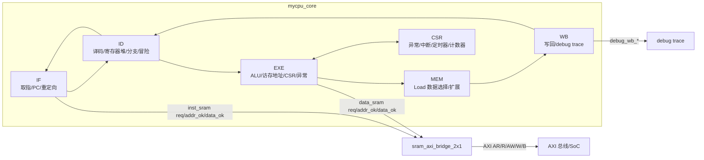

# myCPU: LoongArch 五级流水 AXI CPU

5.25 更新：

- 已完成 CPU 设计实战 exp17。
- 已支持 AXI 总线接口，并通过 AXI 随机延迟验证。
- 上板实验通过，当前主频为 6.25 MHz。由于更高频率可能出现 timing failed，这里将主频调到较低配置。

## 项目简介

本项目实现了一个简化的 32 位 LoongArch 风格 CPU，采用经典五级流水结构，并在顶层提供 AXI 总线接口。CPU 内核仍使用类 SRAM 的取指/访存请求接口，顶层 `mycpu_top.v` 通过 `sram_axi_bridge_2x1` 将内部指令 SRAM、数据 SRAM 请求转换为 AXI 读写事务，用于对接 exp17 的 AXI SoC 环境。



五级流水划分：

- IF: 取指、维护 PC、处理分支/异常/`ertn` 重定向。
- ID: 译码、读寄存器、分支判断、冒险检测和数据前递。
- EXE: 执行、访存地址计算、异常/中断处理、CSR 访问。
- MEM: Load 数据选择、符号扩展或零扩展。
- WB: 写回寄存器堆并输出 debug trace。

当前版本已经支持 exp17 所需的 AXI 总线访问能力，同时保留 exp13 已完成的 CSR、异常、中断、定时器和计数器相关功能。

## 文件说明

- `mycpu_top.v`: 顶层文件，包含 `mycpu_top`、`mycpu_core`、`sram_axi_bridge_2x1`，以及仿真/互连辅助模块 `axi_crossbar_1x2`、`axi_ram`。
- `mycpu.vh`: 全局宏定义，包括流水总线宽度、异常编码、中断位号等。
- `if_stage.v`: IF 级，维护 PC、发起取指、处理分支/异常/`ertn` 重定向，并检测取指地址错 ADEF。
- `id_stage.v`: ID 级，完成指令译码、寄存器读取、分支判断、数据前递、冒险阻塞和非法指令 INE 检测。
- `exe_stage.v`: EXE 级，执行 ALU 运算，生成访存控制，检测 ALE，处理 CSR、异常、中断和 `ertn`。
- `mem_stage.v`: MEM 级，根据访存类型完成 Load 数据选择、符号扩展或零扩展。
- `wb_stage.v`: WB 级，产生寄存器堆写回总线和 debug trace。
- `csr_regfile.v`: CSR 寄存器堆，包含异常现场、中断、定时器和稳定计数器支持。
- `alu.v`: 算术逻辑单元。
- `regfile.v`: 32 个 32 位通用寄存器，双读单写，`r0` 恒为 0。
- `decoder_*.v`: 多级译码器模块。
- `tlb.v`: TLB 相关模块文件，供后续扩展或实验环境使用。
- `CPU设计实战(LoongArch版)fudan.pdf`: 实验指导文档。
- `LoongArch-Vol1-v1.10-CN.pdf`: LoongArch 手册，用于查阅指令编码和 CSR 定义。

## 已支持的主要功能

### 基础指令

支持常见 LoongArch 整数指令，包括：

- 算术逻辑：`add.w`、`sub.w`、`slt`、`sltu`、`nor`、`and`、`or`、`xor`
- 立即数逻辑：`slti`、`sltui`、`andi`、`ori`、`xori`
- 移位：`slli.w`、`srli.w`、`srai.w`、`sll.w`、`srl.w`、`sra.w`
- 立即数/PC：`addi.w`、`lu12i.w`、`pcaddu12i`
- 乘除法：`mul.w`、`mulh.w`、`mulh.wu`、`div.w`、`div.wu`、`mod.w`、`mod.wu`
- 访存：`ld.b`、`ld.h`、`ld.w`、`ld.bu`、`ld.hu`、`st.b`、`st.h`、`st.w`
- 跳转分支：`jirl`、`b`、`bl`、`beq`、`bne`、`blt`、`bge`、`bltu`、`bgeu`

### CSR 和系统指令

支持以下 CSR/系统相关指令：

- `csrrd`
- `csrwr`
- `csrxchg`
- `ertn`
- `syscall`
- `rdcntvl.w`
- `rdcntvh.w`
- `rdcntid`

`rdcntid` 按 LoongArch 编码通过 `rdtimel.w r0, rj` 形式区分，目的寄存器为 `rj`；`rdcntvl.w` 和 `rdcntvh.w` 的目的寄存器为 `rd`。

### CSR 寄存器

`csr_regfile.v` 当前实现的主要 CSR 包括：

- `CRMD`: 当前模式与中断使能。
- `PRMD`: 异常前的模式与中断使能保存。
- `ECFG`: 中断局部使能配置。
- `ESTAT`: 异常状态、中断 pending 位、异常编码。
- `ERA`: 异常返回地址。
- `EENTRY`: 异常入口地址。
- `SAVE0` ~ `SAVE3`: 软件保存寄存器。
- `BADV`: 地址相关异常的出错虚地址。
- `TID`: 计时器编号。
- `TCFG`: 定时器配置。
- `TVAL`: 定时器当前值。
- `TICLR`: 定时器中断清除。

实现细节：

- `ECFG` 仅保留测试和手册要求的合法中断使能位，非法位写入被屏蔽。
- `BADV` 只在 ADEF/ALE 这类地址相关异常时更新，避免 `syscall` 等异常覆盖有效地址现场。
- 定时器中断位使用 `ESTAT.IS[11]`。
- `TICLR` 写 1 清除定时器中断 pending，避免清除后因 `TVAL == 0` 立即重新置位。

## AXI 总线接口

顶层 `mycpu_top` 对外提供 AXI 接口，内部结构如下：

- `mycpu_core` 内部使用类 SRAM 请求/响应接口，分为指令通道和数据通道。
- `sram_axi_bridge_2x1` 将两路内部 SRAM 风格请求合并为一路 AXI 主接口。
- 指令访问只发起 AXI 读事务。
- 数据访问可发起 AXI 读事务或写事务。
- 当前桥接逻辑一次只处理一个请求；当指令和数据请求同时出现时，数据请求优先。
- AXI 读写均使用单拍传输，`arlen/awlen = 0`，`arburst/awburst = INCR`。
- AXI ID 约定：指令读使用 `arid = 0`，数据读写使用 ID 1。
- Store 的 byte lane 由 `wstrb[3:0]` 表示，支持字节、半字和字写。

内部类 SRAM 握手信号：

- 请求侧：`*_sram_req`、`*_sram_wr`、`*_sram_size`、`*_sram_wstrb`、`*_sram_addr`、`*_sram_wdata`
- 响应侧：`*_sram_addr_ok`、`*_sram_data_ok`、`*_sram_rdata`

这些信号不再作为 `mycpu_top` 的对外端口，而是作为 CPU 核心和 AXI 桥之间的内部连接。

## 异常和中断

当前支持的异常：

- ADEF: 取指地址错。
- ALE: 访存地址非对齐。
- INE: 指令不存在。
- BRK: 断点异常。
- SYS: `syscall` 系统调用异常。

当前支持的中断：

- 2 个软件中断位。
- 8 个硬件中断输入。
- 1 个定时器中断。

异常/中断处理流程：

1. EXE 级统一选择当前最高优先级异常或中断。
2. 写入 `ESTAT.Ecode` / `ESTAT.EsubCode`、`ERA`，必要时写入 `BADV`。
3. 将 `CRMD.PLv` / `CRMD.IE` 保存到 `PRMD`，并关闭当前中断使能。
4. 冲刷流水线并重定向到 `EENTRY`。
5. `ertn` 从 `ERA` 返回，并从 `PRMD` 恢复 `CRMD` 中的权限级和中断使能。

`mycpu_core` 内部仍保留 `hw_int_in[7:0]` 外部硬件中断输入，并会做 X 安全处理。当前 `mycpu_top` 将该输入固定为 `8'b0`，适配未接外部中断线的 exp17 SoC 顶层。

## 流水线和冒险处理

各级采用 valid/allowin 握手机制：

```verilog
allowin       = !valid || (ready_go && next_allowin);
to_next_valid = valid && ready_go;
```

ID 级完成主要冒险检测和前递选择：

- EXE/MEM/WB 到 ID 的 RAW 数据前递。
- Load-use 冒险阻塞。
- 分支依赖 Load 结果时，通过 `br_stall` 阻止 IF 继续发起错误取指。
- CSR 相关写后读和 `ertn` 相关控制冒险会触发必要阻塞。

访存相关流水控制：

- IF 发起取指请求后等待 `inst_sram_addr_ok` 和 `inst_sram_data_ok`。
- EXE 发起数据访存请求后等待 `data_sram_addr_ok`。
- MEM 对 Load 指令等待 `data_sram_data_ok` 后再向 WB 流动。
- Store 指令在收到写响应对应的 `data_sram_data_ok` 后完成。

## 访存行为

访存类型由 ID 级产生，EXE/MEM 级配合完成：

- `mem_size = 2'b00`: 字节访问。
- `mem_size = 2'b01`: 半字访问。
- `mem_size = 2'b10`: 字访问。
- `mem_unsigned`: 控制 `ld.bu` / `ld.hu` 零扩展。

Store 写掩码：

- `st.b`: 根据 `addr[1:0]` 选择 1 个 byte lane。
- `st.h`: 根据 `addr[1]` 选择低半字或高半字。
- `st.w`: 写 4 个 byte lane。

ALE 检测会抑制异常指令的实际数据写请求。

## 顶层接口

### 时钟和复位

- `aclk`
- `aresetn`

### AXI 读地址通道

- `arid[3:0]`
- `araddr[31:0]`
- `arlen[7:0]`
- `arsize[2:0]`
- `arburst[1:0]`
- `arlock[1:0]`
- `arcache[3:0]`
- `arprot[2:0]`
- `arvalid`
- `arready`

### AXI 读数据通道

- `rid[3:0]`
- `rdata[31:0]`
- `rresp[1:0]`
- `rlast`
- `rvalid`
- `rready`

### AXI 写地址通道

- `awid[3:0]`
- `awaddr[31:0]`
- `awlen[7:0]`
- `awsize[2:0]`
- `awburst[1:0]`
- `awlock[1:0]`
- `awcache[3:0]`
- `awprot[2:0]`
- `awvalid`
- `awready`

### AXI 写数据通道

- `wid[3:0]`
- `wdata[31:0]`
- `wstrb[3:0]`
- `wlast`
- `wvalid`
- `wready`

### AXI 写响应通道

- `bid[3:0]`
- `bresp[1:0]`
- `bvalid`
- `bready`

### debug trace 接口

- `debug_wb_pc[31:0]`
- `debug_wb_rf_we[3:0]`
- `debug_wb_rf_wnum[4:0]`
- `debug_wb_rf_wdata[31:0]`

## exp17 验证说明

当前 RTL 已完成 CPU 设计实战 exp17 的 AXI 接口适配：

- 通过 AXI 随机延迟验证。
- 上板实验通过。
- 当前上板主频配置为 6.25 MHz。

验证过程中重点处理的问题：

- 将顶层接口从类 SRAM 改为 AXI，并保留核心内部类 SRAM 握手。
- IF/MEM 按 `addr_ok` / `data_ok` 等待 AXI 桥返回，适配随机延迟。
- 写事务同时处理 AW/W/B 通道握手，避免写地址和写数据不同步造成流水线提前完成。
- 在指令取指和数据访存同时请求时，由桥接模块仲裁并保证响应回到正确通道。

## 后续改进建议

- 将 AXI 桥从单请求串行处理扩展为可支持更多 outstanding 请求的实现。
- 为 AXI 桥补充更细的单元级测试，覆盖 AW/W 分离握手、读写交错和异常延迟场景。
- 若后续实验引入 TLB/MMU，需要扩展异常类型、地址翻译和 CSR 集合。

## 许可说明

当前目录未包含 `LICENSE` 文件。若需要公开发布，建议补充许可证声明。
