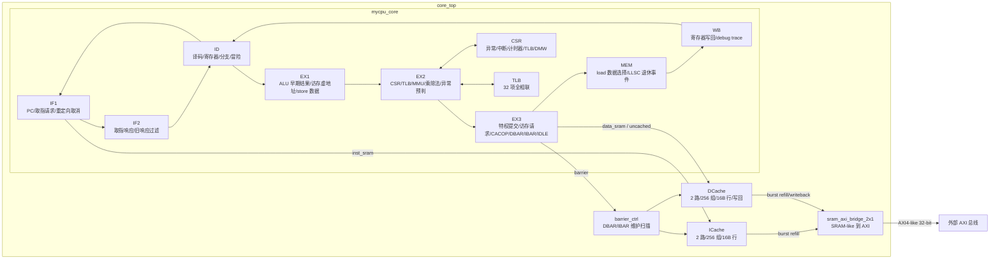

# OurCPU: LoongArch 八级流水 AXI CPU

本仓库是一套使用 Verilog 实现的 32 位 LoongArch 顺序单发射 CPU。当前 RTL
已经拆分为八级流水，并集成了虚实地址转换、CSR、异常与中断、TLB、独立
ICache/DCache、LL/SC、Cache 维护、`DBAR`/`IBAR`、`IDLE` 以及 32 位 AXI
主接口。

> 当前仓库主要包含 CPU RTL。集成到工程时，请将根目录下全部 `.v` 文件加入
> 工程，并以 `core_top` 作为顶层模块。`SIMU` 宏打开时会实例化 Difftest
> 相关模块；综合或普通仿真环境如果没有这些模块，请不要定义 `SIMU`。

## 总体架构

CPU 内核采用八级流水：

```text
IF1 -> IF2 -> ID -> EX1 -> EX2 -> EX3 -> MEM -> WB
取指   回包   译码   前执行  后执行  提交/访存 访存   写回
```

各级之间使用 `valid/allowin` 握手。重定向来源统一汇总到 IF，优先级为：

```text
ERTN > exception > IBAR > branch
```

整体数据通路如下：



## 流水级职责

- `IF1`: 维护 PC，处理分支、异常、`ertn`、`ibar` 等重定向，发起取指请求，并为已发出的旧请求打取消标记。
- `IF2`: 接收取指返回，保存请求 PC 和指令，过滤重定向前遗留的旧响应，向 ID 传递取指异常。
- `ID`: 完成指令译码、寄存器堆读取、分支判断、立即数生成、RAW/CSR/系统指令冒险检测和前递选择。
- `EX1`: 生成组合 ALU 早期结果，计算访存虚地址，准备 store 数据和写掩码，向 ID 暴露可前递结果。
- `EX2`: 执行 CSR 读写准备、TLB 查询/读写/无效化、DMW/TLB 地址转换、乘法流水和迭代除法等待，并形成异常候选信息。
- `EX3`: 当前设计的特权状态提交点。异常、`ertn`、`ibar`、CSR/TLB 副作用、访存请求、`CACOP`、`DBAR`/`IBAR` 和 `IDLE` 的最终发起都在该级仲裁。
- `MEM`: 等待 load 返回，根据访问宽度做符号/零扩展，生成 LL/SC 退休事件，并把最终结果送入 WB。
- `WB`: 写回通用寄存器，输出 `debug0_wb_*` trace，并向 ID 提供 WB 级前递结果。

## 文件说明

| 文件 | 说明 |
| --- | --- |
| `core_top.v` | 顶层、`mycpu_core`、SRAM-like 到 AXI 桥、Cache/Barrier/LLSC/Difftest 连接。 |
| `if_stage.v` | `if1_stage`、`if2_stage` 以及兼容旧接口的 `if_stage` 包装。 |
| `id_stage.v` | 指令译码、寄存器堆读、分支、前递和冒险控制。 |
| `exe_stage.v` | `ex1_stage`、`ex2_stage`、`ex3_stage`，包含执行、地址转换、CSR/TLB 和提交逻辑。 |
| `mem_stage.v` | load 数据处理、LL/SC 退休事件、MEM 到 WB 总线。 |
| `wb_stage.v` | 通用寄存器写回和 trace 输出。 |
| `csr_regfile.v` | CSR、异常入口、`ertn`、中断、计时器、DMW 和 TLB 相关 CSR。 |
| `tlb.v` | 参数化全相联 TLB，core 中实例化为 32 项。 |
| `icache.v` | 2 路 256 组指令 Cache，16B 行，支持整行回填和维护操作。 |
| `dcache.v` | 2 路 256 组数据 Cache，16B 行，写回策略，支持 clean/invalidate。 |
| `barrier_ctrl.v` | `DBAR`/`IBAR` 控制器，`IBAR` 会扫描 DCache 后再扫描 ICache。 |
| `llsc_unit.v` | LL/SC reservation 状态维护。当前 reservation 以 16B 物理 cache line 为粒度。 |
| `alu.v` | ALU、流水乘法器和迭代除法器。 |
| `regfile.v` | 32 个 32 位通用寄存器。 |
| `decoder_*.v` | 译码器基础模块。 |
| `mycpu.vh` | 流水总线宽度、重定向原因、异常码和中断位宏定义。 |

## 支持的主要功能

### 指令

已译码并实现的指令包括：

- 整数运算：`add.w`、`sub.w`、`slt`、`sltu`、`nor`、`and`、`or`、`xor`
- 立即数：`addi.w`、`slti`、`sltui`、`andi`、`ori`、`xori`、`lu12i.w`、`pcaddu12i`
- 移位：`slli.w`、`srli.w`、`srai.w`、`sll.w`、`srl.w`、`sra.w`
- 乘除法：`mul.w`、`mulh.w`、`mulh.wu`、`div.w`、`div.wu`、`mod.w`、`mod.wu`
- 访存：`ld.b`、`ld.h`、`ld.w`、`ld.bu`、`ld.hu`、`st.b`、`st.h`、`st.w`、`preld`
- 原子访存：`ll.w`、`sc.w`
- 分支跳转：`jirl`、`b`、`bl`、`beq`、`bne`、`blt`、`bge`、`bltu`、`bgeu`
- CSR/系统：`csrrd`、`csrwr`、`csrxchg`、`ertn`、`syscall`、`break`、`rdcntvl.w`、`rdcntvh.w`、`rdcntid`
- TLB：`tlbsrch`、`tlbrd`、`tlbwr`、`tlbfill`、`invtlb`
- Cache/同步：`cacop`、`dbar`、`ibar`、`idle`

### CSR

`csr_regfile.v` 当前实现的主要 CSR：

```text
CRMD, PRMD, ECFG, ESTAT, ERA, BADV, EENTRY,
TLBIDX, TLBEHI, TLBELO0, TLBELO1, ASID,
PGDL, PGDH, PGD, CPUID,
SAVE0, SAVE1, SAVE2, SAVE3,
TID, TCFG, TVAL, TICLR, LLBCTL,
TLBRENTRY, DMW0, DMW1
```

异常进入时更新 `ESTAT.Ecode/EsubCode`、`ERA`、`BADV`，保存 `CRMD.PLV/IE`
到 `PRMD` 并关闭当前中断使能。TLB 相关异常还会更新 `TLBEHI.VPPN`。
`ECODE_TLBR` 使用 `TLBRENTRY` 作为入口，其余异常使用 `EENTRY`。

### 地址转换和 TLB

地址转换在 EX2 中完成，取指和数据访存共用同一套规则：

```text
CRMD.PG == 0          -> 直接地址模式，VA 作为 PA
CRMD.PG == 1 且 DMW 命中 -> 使用 DMW 直接映射窗口
CRMD.PG == 1 且 DMW 未命中 -> 查询 TLB
```

TLB 模块是参数化全相联结构，`mycpu_core` 中以 `TLBNUM=32` 实例化。它提供两个
查询端口、一个读端口、一个写端口，支持 4KB、2MB、4MB 页大小匹配，支持 ASID
和全局位 `G`。`tlbfill` 使用内部递增索引选择写入项，`invtlb` 支持 op 0 到 op 6。

当前支持的地址相关异常包括：

- 普通异常：`INT`、`ADEF`、`ALE`、`SYS`、`BRK`、`INE`、`IPE`
- MMU/TLB 异常：`TLBR`、`PIF`、`PIL`、`PIS`、`PME`、`PPI`

### Cache 和访存

ICache 与 DCache 都是 2 路组相联、256 组、每行 16 Byte。每行由 4 个 32 位
bank 组成，通过 4 拍 AXI burst 完成整行回填。顶层中 ICache 作为取指读通路使用，
其 AXI 写回端未接入 bridge；DCache 使用写回策略，脏行替换或维护时会整行写回。

DCache 访问由 EX3 发起。`MAT == 2'b00` 的数据访问走非缓存通路，其余访问走
DCache。非缓存访问在 AXI bridge 中以单拍事务发出；Cache miss、回填和写回使用
4 拍 burst。

`CACOP` 支持按索引和按命中地址维护。`IBAR` 由 `barrier_ctrl` 驱动，流程为：

```text
等待数据侧空闲 -> clean 全部 DCache 行 -> 等待写回完成 -> invalidate 全部 ICache 行 -> 重定向到 IBAR PC + 4
```

由于 Cache 当前为 2 路、256 组，`IBAR` 对 DCache 和 ICache 各扫描 512 个行槽。

### LL/SC

`llsc_unit.v` 维护一个 reservation，粒度为 16B 物理 cache line。`ll.w` 在 MEM
退休时建立 reservation；`sc.w` 在 EX3 查询 reservation，命中时才允许真正写内存，
并在 MEM 退休时返回 1，否则不写内存并返回 0。`sc.w`、`LLBCTL.WCLLB`、未被
`LLBCTL.KLO` 保护的 `ertn` 会清除 reservation。

### DBAR、IBAR 和 IDLE

`DBAR` 会等待数据侧事务排空。`IBAR` 在数据侧排空后执行 DCache clean 和 ICache
invalidate，并在完成后冲刷流水线，从 `IBAR PC + 4` 重新取指。当前实现不区分
hint 等级。

`IDLE` 进入 EX3 后停止发起新的取指请求，等待已使能且未屏蔽的中断唤醒。被中断
唤醒时，异常返回地址按 `IDLE PC + 4` 处理。

## AXI 与集成接口

顶层模块为 `core_top`，时钟和复位为：

```verilog
input aclk;
input aresetn; // low active
```

外部接口包括：

- 32 位 AXI 读写主接口，ID 宽度 4 位，数据宽度 32 位。
- 8 路硬件中断输入 `intrpt[7:0]`，未使用时可接 0。
- trace 输出：`debug0_wb_pc`、`debug0_wb_rf_wen`、`debug0_wb_rf_wnum`、`debug0_wb_rf_wdata`。
- 调试读寄存器接口：`break_point`、`infor_flag`、`reg_num`、`ws_valid`、`rf_rdata`。

`sram_axi_bridge_2x1` 是单事务状态机，仲裁优先级为：

```text
uncached write/read > DCache writeback > DCache refill > ICache refill
```

读通道通过 `arlen=0` 发起非缓存单拍读，通过 `arlen=3` 发起 Cache 行回填。
写通道通过 `awlen=0` 发起非缓存单拍写，通过 `awlen=3` 发起 DCache 脏行写回。

## 冒险和前递

ID 级同时观察 EX1、EX2、EX3、MEM、WB 五个 older producer，并按最近的 older
producer 优先：

```text
EX1 > EX2 > EX3 > MEM > WB
```

只有 producer 标记 `result_ready` 时才前递；load、CSR、乘除法、SC 等结果未就绪
时会阻塞 ID。分支比较复用同一套前递选择，因此 load 后分支、连续写同一目的寄存器
等场景按顺序语义处理。

CSR 写后读、`ertn`、TLB 指令、异常状态相关操作会触发额外阻塞，避免特权状态在
提交点之前被 younger 指令观察到。

## 乘除法实现

`alu.v` 中普通 ALU 操作仍为组合逻辑。乘法使用 `piped_multiplier`，除法和取模
使用 `iter_divider` 迭代实现，避免综合出长组合除法路径。EX2 会在乘除法未完成时
保持阻塞；flush、`ertn` 或 `ibar` 会取消相关状态。

## 仿真和验证状态

仓库目前没有独立 testbench、SoC harness、镜像加载脚本或约束文件。可直接综合/分析
的 RTL 顶层是 `core_top`；如果需要接入 Difftest，请定义 `SIMU` 并提供对应的
`Difftest*` 模块。

建议的最小检查流程：

```text
1. 将根目录全部 .v 文件加入 Vivado/iverilog/Verilator 工程。
2. 未提供 Difftest 模块时不要定义 SIMU。
3. 以 core_top 为顶层做语法分析和 elaboration。
4. 在 SoC/testbench 中覆盖算术、分支、load/store、CSR、异常、中断、TLB、
   Cache、LL/SC、DBAR/IBAR、IDLE 和非缓存访问。
```

## 目录文件

```text
alu.v
barrier_ctrl.v
core_top.v
csr_regfile.v
dcache.v
decoder_2_4.v
decoder_4_16.v
decoder_5_32.v
decoder_6_64.v
exe_stage.v
icache.v
id_stage.v
if_stage.v
llsc_unit.v
mem_stage.v
mycpu.vh
regfile.v
tlb.v
wb_stage.v
```
