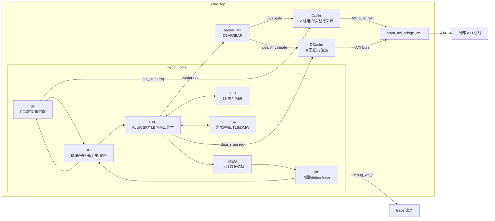

# Ourcpu：LoongArch 五级流水 AXI CPU

本仓库是一套使用 Verilog 实现的 32 位 LoongArch 五级流水 CPU。设计包含
TLB、虚实地址转换、异常与中断、DMW 直接映射窗口、独立的指令/数据
Cache、LL/SC、Cache 维护、栅障与 `IDLE` 指令，对外提供 32 位 AXI 主接口。

> 当前仓库只包含 CPU RTL，没有 testbench、SoC 外设、约束文件或一键构建脚本。
> 集成时请将根目录下全部 `.v` 文件加入工程，并以 `core_top` 作为顶层模块。

## 总体架构

CPU 内核采用经典五级流水：

```text
IF  ->  ID  ->  EXE  ->  MEM  ->  WB
取指    译码    执行    访存    写回
```

流水级之间使用 `valid/allowin` 握手机制：

```verilog
allowin       = !valid || (ready_go && next_allowin);
to_next_valid = valid && ready_go;
```

整体结构如下：



## 文件职责

### `core_top.v`

仓库顶层文件，包含 `core_top`、`mycpu_core` 和
`sram_axi_bridge_2x1` 三个模块，连接五级流水、Cache、AXI 桥接、
debug 接口和外部中断输入。

关键功能：

- 对外提供 AXI 主接口。
- 内部保留类 SRAM 风格的取指和访存请求。
- 在取指通路中实例化 ICache，在访存通路中实例化 DCache。
- 使用 `sram_axi_bridge_2x1` 仲裁 ICache、DCache 和非缓存访存，并转换为
  AXI 读写事务。
- 对外提供 `debug0_wb_*` 提交跟踪信号，以及寄存器调试读取接口。

### `if_stage.v`

取指阶段。

关键功能：

- 维护 PC。
- 发起取指请求。
- 处理分支、异常和 `ertn` 重定向。
- 检测取指地址 ADEF。
- 保存 `req_pc`，保证 AXI 返回数据和发出请求时的 PC 绑定。
- 使用 `req_cancel` 处理请求期间发生的重定向，避免旧响应进入后续流水级。
- 接收 EXE 阶段给出的取指物理地址和取指 TLB 异常。

### `icache.v`

指令 Cache 模块。

关键功能：

- 2 路组相联，256 组，每行 16 Byte。
- 每个 Cache 行包含 4 个 32 位 bank。
- 使用 LRU 选择替换路。
- 使用写回策略；替换或维护脏行时通过 4 拍 burst 写回。
- 通过 `addr_ok/data_ok` 与 IF 阶段握手。
- miss 时通过 `rd_req/rd_rdy` 发起整行读请求。
- 使用 `ret_valid/ret_last` 接收 4 拍 burst 回填数据。
- 文件内包含可综合的同步 RAM 模块 `ram_256x21` 和 `ram_256x32`。

### `dcache.v`

数据 Cache 模块。

关键功能：

- 写回策略，支持脏行驱逐。
- 2 路组相联，256 组，每行 16 Byte。
- 通过 4 拍 AXI burst 回填和写回整行数据。
- 支持普通 Cache 操作与仅 clean 的维护操作。
- 在替换或无效化行时输出通知，用于清除 LL/SC reservation。
- 与 EXE 阶段的数据 SRAM 接口交互。

### `barrier_ctrl.v`

栅障控制器。`dbar` 等待数据侧事务排空；`ibar` 进一步遍历 512 个
DCache 行槽执行 clean，再遍历 512 个 ICache 行槽执行 invalidate。

### `llsc_unit.v`

LL/SC reservation 管理单元。reservation 以 16 Byte 物理 Cache 行为粒度，
并在 SC、相关 store、Cache 行无效化、`LLBCTL.WCLLB` 或未受 KLO 保护的
`ertn` 等事件发生时清除。

### `id_stage.v`

译码阶段。

关键功能：

- 基础指令译码。
- CSR 指令译码。
- TLB 指令译码。
- 通用寄存器读。
- 分支判断。
- RAW 冒险、load-use 冒险、CSR 冒险和系统指令相关阻塞。
- 将 TLB 操作类型和 `invtlb` 操作码通过流水总线送入 EXE。

### `exe_stage.v`

执行阶段，是当前版本中最关键、最复杂的模块。

关键功能：

- 执行 ALU 运算。
- 控制迭代除法器。
- 计算访存虚地址。
- 实例化并访问 TLB。
- 执行 `tlbsrch/tlbrd/tlbwr/tlbfill/invtlb`。
- 实例化 CSR 文件并处理 CSR 读写。
- 完成 DMW/TLB 地址转换。
- 产生 TLB 相关异常。
- 仲裁普通异常、TLB 异常、中断和 `ertn`。
- 控制数据 SRAM/AXI 请求。
- 保证 CSR/TLB 副作用只在提交点发生。

### `mem_stage.v`

访存后处理阶段。

关键功能：

- 等待 load 返回数据。
- 根据 `mem_size` 选择 byte/halfword/word。
- 对 `ld.b/ld.h` 做符号扩展。
- 对 `ld.bu/ld.hu` 做零扩展。
- 将 load 或 ALU 结果送到 WB。

### `wb_stage.v`

写回阶段。

关键功能：

- 写回通用寄存器。
- 输出 debug trace。
- 将最终提交信息反馈给 CSR/异常相关逻辑。

### `csr_regfile.v`

CSR 寄存器堆。

关键功能：

- 基础异常 CSR。
- 中断和定时器 CSR。
- TLB 相关 CSR。
- DMW CSR。
- TLB 指令对 CSR 的副作用。
- 异常入口选择。
- TLB 异常时更新 `BADV` 和 `TLBEHI`。

### `tlb.v`

独立 TLB 模块。

关键功能：

- 16 项全相联 TLB。
- 双查询端口。
- 单读端口。
- 单写端口。
- 支持 `tlbwr`、`tlbfill`、`tlbrd`、`tlbsrch`、`invtlb`。
- 支持 4KB 和 4MB 页。
- 支持 ASID 和 G 全局位匹配。

### `alu.v`

算术逻辑单元。

关键功能：

- 普通 ALU 操作仍为组合逻辑。
- 乘法相关操作保留组合结果选择。
- 除法和取模改为 `iter_divider` 迭代实现，避免组合除法造成严重时序路径。

### `mycpu.vh`

全局宏定义。

关键功能：

- 流水总线宽度。
- 异常码。
- 中断位编号。

## 已支持指令

### 基础整数指令

支持常见 LoongArch 整数指令：

- 算术逻辑：`add.w`、`sub.w`、`slt`、`sltu`、`nor`、`and`、`or`、`xor`
- 立即数：`addi.w`、`slti`、`sltui`、`andi`、`ori`、`xori`、`lu12i.w`、`pcaddu12i`
- 移位：`slli.w`、`srli.w`、`srai.w`、`sll.w`、`srl.w`、`sra.w`
- 乘除法：`mul.w`、`mulh.w`、`mulh.wu`、`div.w`、`div.wu`、`mod.w`、`mod.wu`
- 访存：`ld.b`、`ld.h`、`ld.w`、`ld.bu`、`ld.hu`、`st.b`、`st.h`、`st.w`
- 原子访存：`ll.w`、`sc.w`
- 分支跳转：`jirl`、`b`、`bl`、`beq`、`bne`、`blt`、`bge`、`bltu`、`bgeu`

### CSR 和系统指令

支持以下 CSR/系统相关指令：

- `csrrd`
- `csrwr`
- `csrxchg`
- `ertn`
- `syscall`
- `break`
- `rdcntvl.w`
- `rdcntvh.w`
- `rdcntid`

### TLB 指令

支持以下 TLB 指令：

- `tlbsrch`
- `tlbrd`
- `tlbwr`
- `tlbfill`
- `invtlb`

TLB 指令的状态修改都由 EXE 阶段在提交点统一控制。如果指令被异常、`ertn` 或 flush 冲刷，不会错误修改 TLB 或 CSR。

### Cache 操作指令

支持 `cacop` 指令的 op0、op1、op2 操作：

- op0：对 ICache 操作（按索引）。
- op1：对 DCache 操作（按索引）。
- op2：带地址翻译的 Cache 操作，按需产生 TLBR、PIL、PPI 异常。

### 栅障指令

支持 `dbar hint` 和 `ibar hint`。当前不区分 hint 等级，所有 hint 都按
`hint=0` 的最强语义执行：

- `dbar` 等待此前的数据侧 Cache、非缓存访问和 AXI 数据事务全部完成，
  并在完成前阻止后续访存越过。
- `ibar` 在数据侧排空后 clean 全部 DCache dirty line，再 invalidate
  全部 ICache line，最后清空年轻流水并从 `IBAR PC + 4` 重新取指。

Cache 当前固定为 256 组、2 路，因此 `ibar` 分别扫描 DCache 和 ICache
的 512 个行槽位。修改 Cache 组数或路数时，需要同步调整栅障扫描范围。

### IDLE 指令

支持 `idle level`，编码为 `32'h06488000 | level[14:0]`。指令进入 EXE
后停止发起新的取指请求，并保持等待状态，直到复位或出现已使能、未屏蔽
的中断。中断唤醒时保存的 ERA 为 `IDLE PC + 4`，因此中断处理执行
`ertn` 后从 IDLE 的下一条指令继续运行。

## CSR 实现

当前 CSR 文件支持的主要寄存器：

```text
CRMD
PRMD
ECFG
ESTAT
ERA
BADV
EENTRY
SAVE0, SAVE1, SAVE2, SAVE3
TID
TCFG
TVAL
TICLR
LLBCTL
TLBIDX
TLBEHI
TLBELO0
TLBELO1
ASID
TLBRENTRY
DMW0
DMW1
```

LL.W/SC.W 使用 16 Byte 物理 Cache 行作为 reservation 粒度。Cached LL.W
完成后建立 reservation；SC.W 仅在 reservation 匹配时写内存并向 `rd`
返回 1，否则不写内存并返回 0。SC、`LLBCTL.WCLLB`、未受 KLO 保护的
ERTN、同一行的 store、DCache 替换和 CACOP 无效化会清除 reservation。
非缓存 LL.W 不建立 reservation，非缓存 SC.W 固定失败。

关键行为：

- `CRMD.PG` 控制是否开启分页。
- `CRMD.PLV` 参与 DMW 命中和 TLB 权限检查。
- `PRMD` 保存异常前 `PLV/IE`，`ertn` 时恢复。
- `EENTRY` 是普通异常入口。
- `TLBRENTRY` 是 TLB refill 异常入口。
- `BADV` 保存地址相关异常的出错虚地址。
- TLB 相关异常会把出错虚地址的 `VPPN` 写入 `TLBEHI`。
- `TLBIDX.NE` 表示 `tlbsrch` 或 `tlbrd` 未命中/无效。
- `ASID` 保存当前地址空间编号。
- `DMW0/DMW1` 提供直接映射窗口。

## TLB 设计

`tlb.v` 中每个表项包含：

```text
E
VPPN
PS
ASID
G
PPN0, PLV0, MAT0, D0, V0
PPN1, PLV1, MAT1, D1, V1
```

查询端口：

- `s0`: 取指地址转换。
- `s1`: 数据地址转换，也复用于 `tlbsrch` 和 `invtlb` 匹配。

页大小：

- `PS == 12`: 4KB 页。
- `PS == 22`: 4MB 页。

TLB 命中条件：

```text
表项 E 有效
G 为 1 或 ASID 匹配
VPPN 按页大小匹配
```

命中后根据奇偶页选择 `PPN0` 或 `PPN1`。4KB 页使用 `VA[12]` 区分奇偶页，4MB 页按大页规则拼接物理地址。

## 虚实地址转换

当前地址转换在 `exe_stage.v` 中完成。

取指和数据访存都遵循以下流程：

```text
CRMD.PG == 0
    -> 直接地址模式，虚地址作为物理地址

CRMD.PG == 1 且 DMW 命中
    -> 使用 DMW 直接映射

CRMD.PG == 1 且 DMW 未命中
    -> 查询 TLB
```

DMW 命中条件：

- 当前特权级被 DMW 允许。
- 虚地址高 3 位匹配 DMW 的 `VSEG`。

DMW 物理地址拼接：

```text
{DMW.PSEG, VA[28:0]}
```

TLB 物理地址拼接：

```text
4KB 页: {PPN[19:0], VA[11:0]}
4MB 页: {PPN[19:10], VA[21:0]}
```

## 异常和中断

当前支持的普通异常：

- `INT`: 中断。
- `ADEF`: 取指地址错。
- `ALE`: 访存地址非对齐。
- `SYS`: `syscall`。
- `BRK`: `break`。
- `INE`: 指令不存在。

支持的 TLB/MMU 异常：

- `TLBR`: TLB refill，TLB 重填例外。
- `PIF`: 取指页无效例外。
- `PIL`: load 页无效例外。
- `PIS`: store 页无效例外。
- `PME`: 页修改例外。
- `PPI`: 页特权等级不合规例外。

TLB 异常判断：

```text
TLB 未命中                      -> TLBR
取指命中但 V == 0               -> PIF
load 命中但 V == 0               -> PIL
store 命中但 V == 0              -> PIS
store 命中有效页但 D == 0        -> PME
当前 PLV 权限大于页表项 PLV      -> PPI
```

异常入口选择：

```text
Ecode == TLBR -> TLBRENTRY
其他异常      -> EENTRY
```

异常发生时：

1. 写入 `ESTAT.Ecode/EsubCode`。
2. 写入 `ERA`。
3. 地址相关异常写入 `BADV`。
4. TLB 相关异常更新 `TLBEHI.VPPN`。
5. 保存 `CRMD.PLV/IE` 到 `PRMD`。
6. 关闭当前中断使能。
7. 冲刷流水线并跳转到异常入口。

`ertn` 执行时：

1. 从 `ERA` 返回。
2. 从 `PRMD` 恢复 `CRMD.PLV/IE`。
3. 清理异常返回导致的流水线副作用。

## 流水线和冒险处理

ID 阶段负责主要冒险检测：

- MEM/WB 到 ID 的数据前递。
- load-use 冒险阻塞。
- CSR 写后读冒险阻塞。
- `ertn` 和异常状态相关阻塞。
- TLB 指令作为系统类指令处理。

为了满足实现时序，当前版本对 EXE 结果相关的前递做了保守化处理：

```text
依赖 EXE 结果的后续指令不再同周期直接从 EXE 前递，而是等待到 MEM/WB 可前递后再继续。
```

这样会牺牲少量性能，但可以缩短以下关键组合路径：

```text
EXE 结果 -> ID 分支判断 -> IF 取指请求
```

## 除法器和时序优化

原先如果直接使用 Verilog 的 `/` 和 `%` 组合除法，实现中会形成非常长的关键路径。

当前 `alu.v` 中新增 `iter_divider`：

- 32 轮迭代恢复除法。
- 支持有符号和无符号除法。
- 同时支持商和余数输出。
- EXE 阶段遇到 `div.w/div.wu/mod.w/mod.wu` 时暂停流水。
- flush 或 `ertn` 时取消当前除法状态。

## AXI 相关设计

### IF 请求 PC 稳定化

AXI 环境下，取指请求的地址通道和数据返回通道不是同一拍完成。若地址请求发出后发生跳转、异常或 flush，`fetch_pc` 可能已经变化，而旧请求的数据稍后才返回。

为避免旧响应被错误绑定到新 PC，`if_stage.v` 增加：

```text
req_pc
req_cancel
```

现在取指响应对应的 PC 使用 `req_pc`，不是实时变化的 `fetch_pc`。如果请求期间发生重定向，会通过 `req_cancel` 抑制旧响应进入流水线。

### SRAM-to-AXI bridge 请求寄存化

`core_top.v` 中的 `sram_axi_bridge_2x1` 做了请求寄存化：

- 在 IDLE 状态捕获读写请求。
- 下一拍再发 AXI 地址通道。
- 读事务增加 `ST_RD_ADDR` 状态。
- 写事务保存地址、数据和写掩码后再进入 AXI 写地址/写数据阶段。

这切断了：

```text
EXE 访存地址计算 -> AXI RAM/IP 输入
```

从而让设计能够满足实现时序。

### Cache burst 传输

指令 Cache 行大小为 16 Byte，每行包含 4 个 32 位字。AXI bridge 对 ICache 回填请求生成：

```text
ARLEN   = 3
ARSIZE  = 2
ARBURST = INCR
```

读响应阶段会保持到 `RLAST` 到达，并将每拍 `RDATA` 依次送入对应 Cache
的 `ret_valid/ret_last/ret_data` 接口。ICache 和 DCache 都以 4 拍 burst
完成整行回填；两者的脏行写回同样使用 4 拍 burst。非缓存数据访问使用
单拍 AXI 事务。

## 目录和文件

根目录下的 Verilog 文件是当前 CPU 的主实现：

```text
alu.v
barrier_ctrl.v
core_top.v
icache.v
dcache.v
csr_regfile.v
decoder_2_4.v
decoder_4_16.v
decoder_5_32.v
decoder_6_64.v
exe_stage.v
id_stage.v
if_stage.v
llsc_unit.v
mem_stage.v
mycpu.vh
regfile.v
tlb.v
wb_stage.v
```

## 集成接口

`core_top` 使用低有效复位 `aresetn`，时钟端口为 `aclk`。主要外部接口：

- AXI：32 位地址、32 位数据、4 位 ID，支持 burst 读写。
- 中断：`intrpt[7:0]`。
- 提交跟踪：`debug0_wb_pc`、`debug0_wb_rf_wen`、
  `debug0_wb_rf_wnum`、`debug0_wb_rf_wdata`。
- 调试读取：`break_point`、`infor_flag`、`reg_num`、`ws_valid`、
  `rf_rdata`。

RTL 使用 Verilog-2001 风格代码，并在部分模块中使用存储器数组。具体综合、
仿真命令取决于接入的 FPGA/ASIC 工具链和 SoC 验证环境。

## 全局宏定义（`mycpu.vh`）

`mycpu.vh` 定义了流水线数据通路宽度、异常编码和中断位编号，被各模块通过 `include` 引用。主要常量包括：

- 流水总线相关：ALU 结果、访存地址、写回数据等信号的位宽定义。
- 异常码：`ADEF`、`ALE`、`SYS`、`BRK`、`INE`、`TLBR`、`PIF`、`PIL`、`PIS`、`PME`、`PPI`、`INT`。
- 中断位编号：`int_hw_pin`、`int_timer`、`int_ipi`。

## 设计要点

### CSR/TLB 副作用只在提交点发生

TLB 指令和 CSR 写指令的状态修改都由 EXE 阶段在提交点统一控制。如果指令被异常、`ertn` 或 flush 冲刷，不会错误修改 TLB 或 CSR。这是保证正确性的关键设计。

### Cache 一致性

数据访存使用 DCache，ICache 和 DCache 分别通过 AXI bridge 与外部交互。bridge 在 IDLE 状态下优先接受数据 SRAM 请求，其次接受 ICache 回填请求，保证两类事务不会在 AXI 读通道上交叉。
